deep learning rất mạnh với các mô hình nhiêu tham số

có rất yếu tố cản trở chiển khai một mô hình lớn: 

- các thiết bị có giới hạn tài nguyên tính toán, giới hạn phần cứng (điện thoại di dộng, thiết bị nhúng)

- độ tính toán phức tạp lớn, thời gian chạy lâu

- yêu cầu bộ nhớ lưu trữ lớn

từ đó có nhiều nghiên cứu tập trung và sử dụng các kỹ thuật để nén và tăng tốc độ xử lý của mô hình

1) có kỹ thuật eficient building blocks for deep models (MobileNets, ShuffleNets)

2) modelcompresion and acceleration techiques:

- Parameter pruning and sharing

- Low-rank factorization

- Transferred compact convolutional filters

- Knowledge distillation

Trong các kỹ thuật đó có knowledge distillation: chắt lọc kiến thức học một cách hiệu quả vào small student model từ mô hình giáo viên lớn

paper này tập trung vào các khía cạnh của knowledge distillation:

- knowledge categories

- training schemes

- teacher-student architecture

- distillation algorithms

- performance comparison, applications and challenges

A knowledge distillation system is composed of three key components: knowledge ,distillation algorithm, teacher-student architecture

các papers liên quan:

- Cheng, X., Rao, Z., Chen, Y., & Zhang, Q. (2020). Explaining knowledge distillation by quantifying the knowledge. In CVPR. Quantified the extraction of visual concepts from the intermediate layers of a deep neural network, to explain knowledge distillation

- Phuong, M., & Lampert, C. H. (2019a). Towards understanding knowledge distillation. In ICML. obtained a theoretical justification for a generalization bound with fast convergence of learning distilled student networks in the scenario of deep linear classifiers. Relies on data geometry, optimization bias of distillation objective and strong monotonicity of the student classifier

- Cho, J. H. & Hariharan, B. (2019). On the efficacy of knowledge distillation. In ICCV. Empirically analyzed in detail the efficacy of knowledge distillation 

- Ji, G., & Zhu, Z. (2020). Knowledge distillation in wide neural networks: Risk bound, data efficiency and imperfect teacher. In NeurIPS. Theoretically explained knowledge distillation on a wide neural network from the respective of risk bound, data efficiency and imperfect teacher.

- Mirzadeh, S. I., Farajtabar, M., Li, A. & Ghasemzadeh, H. (2020). Improved knowledge distillation via teacher assistant. In AAAI. Larger model may not be a better teacher because of model capacity gap

- Tang, J., Shivanna, R., Zhao, Z., Lin, D., Singh, A., Chi, E. H., & Jain, S. (2020). Understanding and improving knowledge distillation. arXiv preprint. Knowledge distillation has also been explored for label smoothing, for assessing the accuracy of the teacher and for obtaining a prior for the optimal output layer geometry

- Hinton, G., Vinyals, O. & Dean, J. (2015). Distilling the knowledge in a neural network. arXiv preprint arXiv:1503.02531

- Zhang, Y., Xiang, T., Hospedales, T. M. & Lu, H. (2018b). Deep mutual learning. In CVPR.

- Mirzadeh, S. I., Farajtabar, M., Li, A. & Ghasemzadeh, H. (2020). Improved knowledge distillation via teacher assistant. In AAAI

- Zhai, M., Chen, L., Tung, F., He, J., Nawhal, M. & Mori, G. (2019). Lifelong gan: Continual learning for conditional image generation. In ICCV

- Yuan, L., Tay, F. E., Li, G., Wang, T. & Feng, J. (2020). Revisit knowledge distillation: a teacher-free framework. In CVPR

- Wang, L., & Yoon, K. J. (2020). Knowledge distillation and student-teacher learning for visual intelligence: A review and new outlooks. Một survey tương tự cho vision

Phần lớn các nghiên cứu mới của KD tập trung vào nén deep neural networks

KD có thể được sử dụng cho các tác vụ khác như: adversarial attacks, data augmentation, data privacy and security, dataset distillation (large dataset into a small dataset to reduce the training loads of deep models)

2. Knowledge

- a vanilla kd uses the logitsof a large deep model as the teacher knowledge

- activations, neurons or features of intermeddiate layers also can be used as the knowledge to guide the learning of the student model

- the relationships between different activations, neurons or pairs of samples contain rich information learned by the teacher model

- parameters or the connections between layers of the teacher model also contain another knowledge

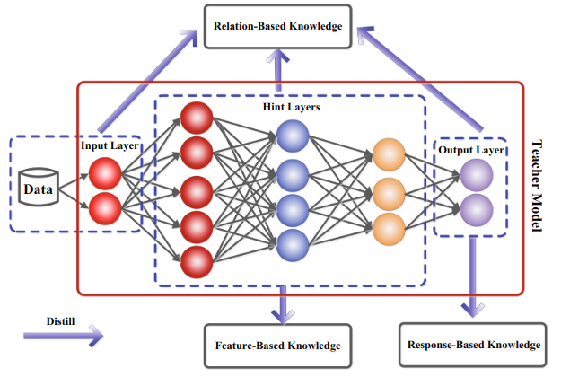

2.1. Response-Based Knowledge

- Response-Based Knowledge = reponse of the last output layer of the teacher model. Mimic the final prediction of the teacher model

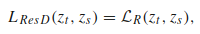

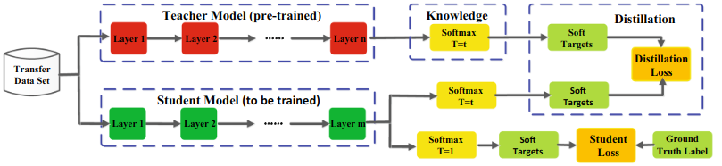

- điểm mạnh: dễ hiểu, dark knowledge from the teacher model, soft targets tương tụ với label smoothing or regularizers

- điểm yếu: phụ thuộc vào output cuối cùng, không sử dụng intermediate-level supervision from the teacher model, limited to the supervised learning

2.2. Feature-Based Knowledge

- Feature-Based Knowledge = using both output of the last layer and the output of intermediate layers

- directly match the feature activations of the teacher and the student

- Zagoruyko, S. & Komodakis, N. (2017). Paying more attention to attention: Improving the performance of convolutional neural networks via attention transfer. In ICLR. "Attention map" from the original feature maps to express knowledge.

- Huang, Z. & Wang, N. (2017). Like what you like: Knowledge distill via neuron selectivity transfer. arXiv preprint. The attention map using neuron selectivity transfer.

- Passalis, N. & Tefas, A. (2018). Learning deep representations with probabilistic knowledge transfer. In ECCV. Transerred knowledge by matchingthe probability distribution in feature space. 

- Kim, J., Park, S. & Kwak, N. (2018). Paraphrasing complex network: Network compression via factor transfer. In NeurIPS. Make it easier to transfer the teacher knowledge, introduced "factors" as a more understandable form of intermediate representations.

- Jin, X., Peng, B., Wu, Y., Liu, Y., Liu, J., Liang, D., Yan, J., & Hu, X. (2019). Knowledge distillation via route constrained optimization. In ICCV. Proposed route constrained hint learning, which supervises student by outputs of hint layers of teacher.

- Heo, B., Lee, M., Yun, S. & Choi, J. Y. (2019c). Knowledge transfer via distillation of activation boundaries formed by hidden neurons. In AAAI. use the activation boundary of the hidden neurons for knowledge transfer.

- Zhou, G., Fan, Y., Cui, R., Bian, W., Zhu, X. & Gai, K. (2018). Rocket launching: A universal and efficient framework for training well-performing light net. In AAAI. parameter sharing of intermediate layers of the teacher model together with response-based knowledge.

- Chen, D., Mei, J. P., Zhang, Y., Wang, C., Wang, Z., Feng, Y., & Chen, C. (2021). Cross-layer distillation with semantic calibration. In AAAI. To match the semantics between teacher and student, proposed cross-layer knowledge distillation, which adaptively assigns proper teacher layers for each student layer via attention allocation.

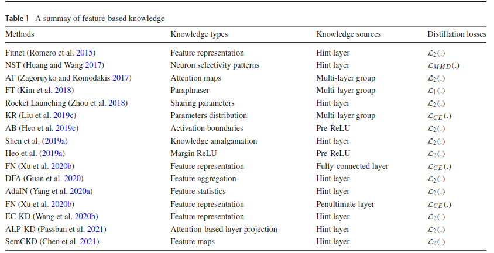

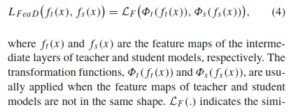

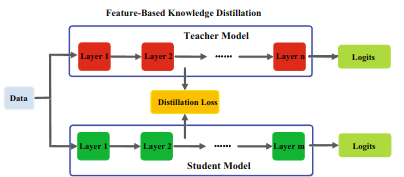

2.3. Relation-Based Knowledge

Further explores the relationships between different layers or data samples

- Yim, J., Joo, D., Bae, J. & Kim, J. (2017). A gift from knowledge distillation: Fast optimization, network minimization and transfer learning. In CVPR. To explore the relationships between different feature maps, Yim et al. (2017) proposed a flow of solution process (FSP), which is defined by the Gram matrix between two layers. The FSP matrix summarizes the relations between pairs of feature maps. It is calculated using the inner products between features from two layers

- Lee, S. H., Kim, D. H. & Song, B. C. (2018). Self-supervised knowledge distillation using singular value decomposition. In ECCV. Using the correlations between feature maps as the distilled knowledge, knowledge distillation via singular value decomposition was proposed to extract key information in the feature maps

- Zhang, C. & Peng, Y. (2018). Better and faster: knowledge transfer from multiple self-supervised learning tasks via graph distillation for video classification. In IJCAI. To use the knowledge from multiple teachers, Zhang and Peng (2018) formed two graph by respectively using the logits and features of each teacher model as the nodes. Specifically, the importance and relationships of the different teachers are modeled by the logits and representation graphs before the knowledge transfer

- Lee, S. & Song, B. (2019). Graph-based knowledge distillation by multihead attention network. In BMVC. Multi-head graph-based knowledge distillation was proposed by Lee and Song (2019). The graph knowledge is the intra-data relations between any two feature maps via multi-head attention network

- Passalis, N., Tzelepi, M., & Tefas, A. (2020b). Heterogeneous knowledge distillation using information flow modeling. In CVPR. 

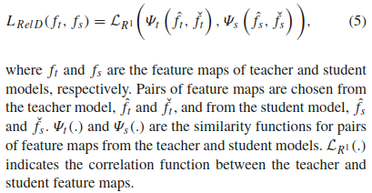

- Traditional knowledge transfer methods often involve individual knowledge distillation. The individual soft targets of a teacher are directly distilled into student. In fact, the distilled knowledge contains not only feature information but also mutual relations of data samples.

- Liu, Y., Cao, J., Li, B., Yuan, C., Hu, W., Li, Y. & Duan, Y. (2019g). Knowledge distillation via instance relationship graph. In CVPR. Specifically, Liu et al. (2019g) proposed a robust and effective knowledge distillation method via instance relationship graph. The transferred knowledge in instance relationship graph contains instance features, instance relationships and the feature space transformation cross layers

- Park, W., Kim, D., Lu, Y. & Cho, M. (2019). Relational knowledge distillation. In CVPR. Park et al. (2019) proposed a relational knowledge distillation, which transfers the knowledge from instance relations

- Chen, H., Wang, Y., Xu, C., Xu, C., & Tao, D. (2021). Learning student networks via feature embedding. IEEE TNNLS, 32(1), 25–35. Based on idea of manifold learning, the student network is learned by feature embedding, which preserves the feature similarities of samples in the intermediate layers of the teacher networks

- The relations between data samples are modelled as probabilistic distribution using feature representations of data (Passalis, N. & Tefas, A. (2018). Learning deep representations with probabilistic knowledge transfer. In ECCV; Passalis, N., Tzelepi, M., & Tefas, A. (2020a). Probabilistic knowledge transfer for lightweight deep representation learning. TNNLS). The probabilistic distributions of teacher and student are matched by knowledge transfer

- Tung, F., & Mori, G. (2019). Similarity-preserving knowledge distillation. In ICCV. proposed a similarity-preserving knowledge distillation method. In particular, similarity-preserving knowledge, which arises from the similar activations of input pairs in the teacher networks, is transferred into the student network, with the pairwise similarities preserved

- Peng, B., Jin, X., Liu, J., Li, D., Wu, Y., Liu, Y., et al. (2019a). Correlation congruence for knowledge distillation. In ICCV. proposed a knowledge distillation method based on correlation congruence, in which the distilled knowledge contains both the instance-level information and the correlations between instances. Using the correlation congruence for distillation, the student network can learn the correlation between instances

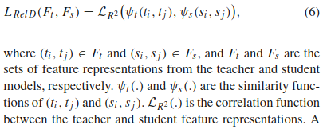

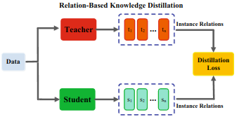

DK can be categorized:

- Structured knowledge of the data

- Priviledged inform

3. Distillation Schemes (sơ đồ chưng cất) (cách teacher và student được huấn luyện như thế nào?)

offline: teacher dạy cho student

online: cả teacher và student cùng học với nhau

self: student tự dạy chính mình

ba loại chưng chất này có thể kết hợp để bổ sung cho nhau do có những ưu điểm riêng. Ví dụ: cả phương pháp tự chất lọc và chặt lọc trực tuyến ddeeeuf được tích hợp hợp lý thông qua khung chuyển giao đa kiến thức Sun et al 2021

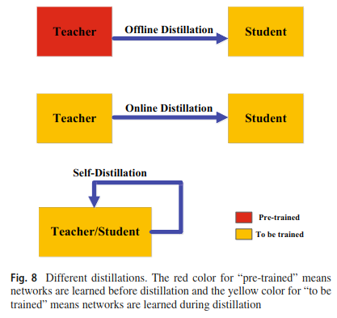

3.1. Offline Distillation

Kiến thức được chuyển từ một pre-trained teacher model sang cho một student model. Có 2 bước:

- Bước 1: huấn luyện mô hình teacher trước

- Bước 2: sử dụng thông tin của teacher model để huấn luyên mô hình student

các nghiên cứu tập trung vào bước thứ 2: design of knowledge, loss functions for matching features or distributions matching

đơn giản, dễ thực hiện. Tuy nhiên vẫn cần nhiều tài nguyên để huấn luyện mô hình teacher, luôn tồn tại gap giữa teacher và student, và student phụ thuộc phần lớn vào teacher

Một số nghiên cứu liên quan:

- (design of knowledge) Hinton, G., Vinyals, O. & Dean, J. (2015). Distilling the knowledge in a neural network

- (design of knowledge) Romero, A., Ballas, N., Kahou, S. E., Chassang, A., Gatta, C., & Bengio, Y. (2015). Fitnets: Hints for thin deep nets. In ICLR.

- (loss functions) Huang, Z. & Wang, N. (2017). Like what you like: Knowledge distill via neuron selectivity transfer

- (loss functions) Passalis, N. & Tefas, A. (2018). Learning deep representations with probabilistic knowledge transfer. In ECCV

- (loss functions) Zagoruyko, S. & Komodakis, N. (2017). Paying more attention to attention: Improving the performance of convolutional neural networks via attention transfer. In ICLR

- (loss functions) Mirzadeh, S. I., Farajtabar, M., Li, A. & Ghasemzadeh, H. (2020). Improved knowledge distillation via teacher assistant. In AAAI

- (loss functions) Li, T., Li, J., Liu, Z., & Zhang, C. (2020d). Few sample knowledge distillation for efficient network compression. In CVPR

- (loss functions) Heo, B., Lee, M., Yun, S. & Choi, J. Y. (2019b). Knowledge distillation with adversarial samples supporting decision boundary. In AAAI

- (loss functions) Asif, U., Tang, J. & Harrer, S. (2020). Ensemble knowledge distillation for learning improved and efficient networks. In ECAI

3.2. Online Distillation

Được dùng để khắc phục các nhược điểm của Offline Distillation

Cả teacher và student cùng được update đồng thời

deep mutual learning (học tập lẫn nhau) (Zhang et al 2018b)

để cải thiện khả năng khái quát hóa, việc học sâu lẫn nhau được mở rộng bằng cách sử dụng tập hợp các logit mềm (Guo et al. 2020)

Chen et al 2020a giới thiệu thêm auxiliary peers (ngang hàng phụ trợ) và một group leader vào deep mutual learning để tạo thành một tập hợp đa dạng các mô hình ngang hàng

để giảm chi phí tính toán, Zhu and Gong 2018 đã đề xuất kiến trúc đa nhánh, trong đó mỗi nhãnh chỉ ra một mô hình student và các nhánh khác nhau chia sẻ chung một backbone network

Thay vì sử dụng tập hợp các bản ghi, Kim at al. 2019b đã giới thiệu mô-đun feature fusion để xây dựng teacher classifier

Xie et al 2019 đã thay thế lớp tích chập bằng các phép toán tích chập rẻ tiền để tạo thành mô hình student

Anil et al. 2018 đã sử dụng phương pháp online distillation to train large-scale distributed neural network, and proposed a variant of online distillation called co-distillation. Co-distillation một cách song song, huấn luyện nhiều mô hình với cùng một kiến trúc và bất cứ một mô hình nào cũng được đào tạo bằng cách chuyển giao kiến thức từ các mô hình khác.

Một phương pháp online adversarial knowledge distillation được đề xuất để huấn luyện nhiều mạng song song bằng discriminators sử dụng kiến từ từ cả class probabilities and feature map Chung et al 2020

Adversarial co-distillation được phát minh sử dụng GAN để sinh ra các mẫu đa dạng Zhang et al. 2021a

Online distillation sử dụng một giai đoạn, tính toán song song hiệu quả. Tuy nhiên các phương pháp hiện tại ví dụ như mutual learning thường không giải quyết được high-capacity teacher trong online settings, đo đó vẫn còn nhiều nghiên cứu tập trung khám phá sâu hơn mối quan hệ giữa mô hình teacher và student trong online settings.

3.3. Self-Distillation

trong self-distillation, những mạng giống nhau được sử dụng cho cả teacher và student models. Là một trường hợp đặt biệt của online distillation

Zhang et al. 2019b đã đề xuất một phương pháp tự chắt lọc mới, trong đó kiến ​​thức từ các phần sâu hơn của mạng được chắt lọc thành các phần nông của nó

một nghiên cứu tương tựng như trên, self-attention distillation được đề xuất để  phát hiện làn đường Hou et al. 2019. Network sử dụng attention maps của những lớp của chính nó như một distillation targets cho những layer thấp hơn

Snapshot distillation (Yang et al. 2019b), sử dụng kiến thức từ những epochs ban đầu của network (teacher) chuyền cho chính nó cho những epochs sau này (student) để hỗ trợ quá trình huấn luyện supervised trong cùng một mạng

Để giảm hơn nữa thời gian suy luận thông qua early exit. Phuong and Lampert 2019b đề xuất distillation-based training scheme mà trong đó những early exit layer cố gắng bắt chước output của later exit layer trong quá trình huấn luyện 

self-distillation đã được phân tích về mặt lý thuyết trong nghiên cứu của Mobahi et al 2020 và hiệu suất được cải thiện của nó đã được chứng minh bằng thực nghiệm trong nghiên cứu của Zhang and Sahuncu 2020

Yuan et al. 2020 đã đề xuất phương pháp teacher-free knowledge distillation dự trên phân tích của label smoothing regularization

Hahn and Choi 2019 đã đề xuất một phương pháp self-knowledge mới, trong đó self-knowledge bao gồm xác suất được dự đoán thay vì xác suất mềm truyền thống. Các xuất suất dự đoán này được xác định bởi các biểu diễn đặc điểm của mô hình đào tạo. Chúng phán ánh sự tương đồng dủa dự liệu trong feature embedding space.

Yun et al. 2020 để xuất class-wise self-knowledge distillation to match the output distributions của mô hình huấn luyện giữa intra-class smaples và augmented samples với cùng một nguồn và mô hình.

Lee et al. 2019a thông qua data augmentation và self-knowledge of augmentation được chắt lọc vào mô hình chính nó.

self distillation cũng được áp dụng để tối hưu hóa các mô hình sâu (teacher or student networks) có cùng kiến trúc one by one. Mỗi mạng chắt lọc kiến thức của mạng trước đó bằng cách sự dụng một teacher-student optimization

4. Teacher-Student Architecture

kiến trúc của teacher và student ảnh hưởng đến những kiến thức nào được chắt lọc, và khả năng tiếp thu của những kiến thức đó

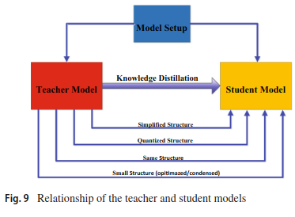

5. KD Algorithms

5.1. Adversarial KD

5.2. Multi-Teacher KD

5.3. Cross-Modal KD

5.4. Graph-Based KD

5.5. Attention-Based KD

5.6. Data-Free KD

5.7. Quantized KD

5.8. Lifelong KD

5.9. NAS-Based KD

